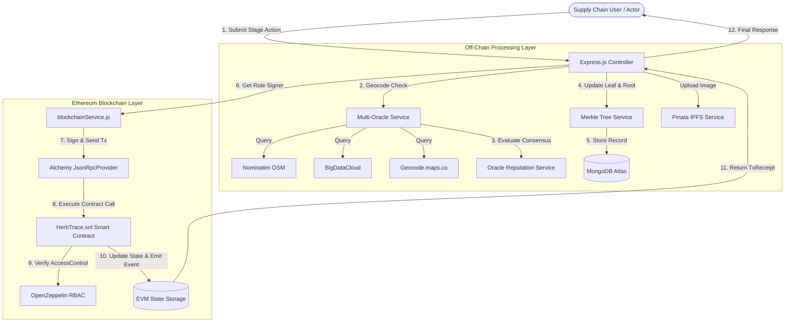

# 12. HerbTrace Blockchain Component — Technical Details & Specifications

> **Document Purpose**: Authoritative, code-backed technical reference for the **Blockchain Component** of the HerbTrace system. This document provides complete source-traceable specifications, smart contract details, cryptographic formulations, role-based access control models, and event architectures required to write the blockchain section of a journal paper.

---

## Source Traceability Matrix

Every claim, schema, function, and equation in this document has been verified directly against the production codebase.

| Component / Subsystem | Primary Source Files Inspected |
|---|---|
| **Smart Contract** | [`herbtrace-contracts/contracts/HerbTrace.sol`](file:///c:/Users/RAMAKANT%20DHULAP/Desktop/New%20folder%20%284%29/HerbTrace/herbtrace-contracts/contracts/HerbTrace.sol) |
| **Contract Test Suite** | [`herbtrace-contracts/test/HerbTraceV2.test.js`](file:///c:/Users/RAMAKANT%20DHULAP/Desktop/New%20folder%20%284%29/HerbTrace/herbtrace-contracts/test/HerbTraceV2.test.js), [`herbtrace-contracts/test/Benchmark.gas.test.js`](file:///c:/Users/RAMAKANT%20DHULAP/Desktop/New%20folder%20%284%29/HerbTrace/herbtrace-contracts/test/Benchmark.gas.test.js) |
| **Compiler & Network Config** | [`herbtrace-contracts/hardhat.config.js`](file:///c:/Users/RAMAKANT%20DHULAP/Desktop/New%20folder%20%284%29/HerbTrace/herbtrace-contracts/hardhat.config.js), [`herbtrace-contracts/package.json`](file:///c:/Users/RAMAKANT%20DHULAP/Desktop/New%20folder%20%284%29/HerbTrace/herbtrace-contracts/package.json) |
| **Deployment Scripts** | [`herbtrace-contracts/scripts/deployV2.js`](file:///c:/Users/RAMAKANT%20DHULAP/Desktop/New%20folder%20%284%29/HerbTrace/herbtrace-contracts/scripts/deployV2.js), [`herbtrace-contracts/scripts/grantRole.js`](file:///c:/Users/RAMAKANT%20DHULAP/Desktop/New%20folder%20%284%29/HerbTrace/herbtrace-contracts/scripts/grantRole.js) |
| **Web3 Provider & Signing** | [`herbtrace-backend/services/blockchainService.js`](file:///c:/Users/RAMAKANT%20DHULAP/Desktop/New%20folder%20%284%29/HerbTrace/herbtrace-backend/services/blockchainService.js) |
| **Merkle Tree Service** | [`herbtrace-backend/services/merkleService.js`](file:///c:/Users/RAMAKANT%20DHULAP/Desktop/New%20folder%20%284%29/HerbTrace/herbtrace-backend/services/merkleService.js) |
| **Multi-Oracle & Consensus** | [`herbtrace-backend/services/multiOracleService.js`](file:///c:/Users/RAMAKANT%20DHULAP/Desktop/New%20folder%20%284%29/HerbTrace/herbtrace-backend/services/multiOracleService.js), [`herbtrace-backend/services/oracleReputationService.js`](file:///c:/Users/RAMAKANT%20DHULAP/Desktop/New%20folder%20%284%29/HerbTrace/herbtrace-backend/services/oracleReputationService.js) |
| **Backend Business Logic** | [`herbtrace-backend/services/batchService.js`](file:///c:/Users/RAMAKANT%20DHULAP/Desktop/New%20folder%20%284%29/HerbTrace/herbtrace-backend/services/batchService.js), [`herbtrace-backend/controllers/batchController.js`](file:///c:/Users/RAMAKANT%20DHULAP/Desktop/New%20folder%20%284%29/HerbTrace/herbtrace-backend/controllers/batchController.js) |
| **Database Schemas** | [`herbtrace-backend/models/Batch.js`](file:///c:/Users/RAMAKANT%20DHULAP/Desktop/New%20folder%20%284%29/HerbTrace/herbtrace-backend/models/Batch.js), [`herbtrace-backend/models/BatchMerkleRoot.js`](file:///c:/Users/RAMAKANT%20DHULAP/Desktop/New%20folder%20%284%29/HerbTrace/herbtrace-backend/models/BatchMerkleRoot.js), [`herbtrace-backend/models/LocationVerification.js`](file:///c:/Users/RAMAKANT%20DHULAP/Desktop/New%20folder%20%284%29/HerbTrace/herbtrace-backend/models/LocationVerification.js) |

---

## 1. Smart Contract Overview

### Contract Metadata & Configuration
- **Contract Name**: `HerbTrace`
- **Source File**: `herbtrace-contracts/contracts/HerbTrace.sol`
- **Solidity Version**: `pragma solidity ^0.8.0;` (Compiled with Solc `0.8.27` via Hardhat)
- **OpenZeppelin Dependency**: `@openzeppelin/contracts/access/AccessControl.sol` (v5.6.1)
- **Inheritance Pattern**: `contract HerbTrace is AccessControl`
- **EVM Compatibility**: Ethereum Virtual Machine (EVM) standard byte-code format

### Deployment Status & Target Networks
- **Local Hardhat Network**: **DEPLOYED & VERIFIED** (Automated integration and Hardhat test suite in `HerbTraceV2.test.js`)
- **Sepolia Testnet Configuration**: **CONFIGURED** (`process.env.SEPOLIA_RPC_URL` configured in `hardhat.config.js`)
- **Configured Contract Address**: `0x984cc9A200DBC2103cb404dA92724611D9b9C4Fa` (Set in `herbtrace-backend/.env`)
- **Verification Status**: Local Hardhat network tests pass 100%; Sepolia configuration is set up for public testnet anchoring.

---

## 2. Smart Contract Architecture (`HerbTrace.sol`)

The `HerbTrace.sol` smart contract acts as an immutable state machine and anchor registry for the herbal supply chain.

### Core Data Structs & Mappings

```solidity
enum Status { Created, Tested, Processed, Transferred }

struct Batch {
    string batchId;
    address currentOwner;
    Status status;
    bytes32 dataHash;
    uint256 lastUpdated;
}

struct MerkleAnchor {
    string batchId;
    uint256 stageIndex;
    bytes32 merkleRoot;
    uint256 timestamp;
}

struct LocationConsensus {
    string batchId;
    uint256 stageIndex;
    string typedLocation;
    bool verified;
    uint256 timestamp;
}
```

### Component Architecture Table

| Component Name | Solidity Type | Purpose / Description |
|---|---|---|
| `FARMER_ROLE` | `bytes32 constant` | `keccak256("FARMER_ROLE")` — Role identifier for agricultural batch creation |
| `LAB_ROLE` | `bytes32 constant` | `keccak256("LAB_ROLE")` — Role identifier for quality test recording |
| `PROCESSOR_ROLE` | `bytes32 constant` | `keccak256("PROCESSOR_ROLE")` — Role identifier for herb processing & parent batch linking |
| `DISTRIBUTOR_ROLE` | `bytes32 constant` | `keccak256("DISTRIBUTOR_ROLE")` — Role identifier for custody transfer |
| `DEFAULT_ADMIN_ROLE` | `bytes32 constant` | OpenZeppelin admin role (`0x00...00`) for RBAC management, Merkle anchoring, & location verifications |
| `batches` | `mapping(string => Batch)` | Primary state mapping from string `batchId` to `Batch` struct |
| `parents` | `mapping(string => string[])` | On-chain parent batch mapping storing parent IDs for derived processed batches |
| `merkleAnchors` | `mapping(string => MerkleAnchor[])` | Mapping from `batchId` to array of on-chain anchored Merkle roots |
| `locationVerifications` | `mapping(string => LocationConsensus[])` | Mapping from `batchId` to array of on-chain multi-oracle location verification records |

---

## 3. Roles and Access Control (RBAC)

HerbTrace enforces Role-Based Access Control via OpenZeppelin's `AccessControl` framework.

### Role & Permission Matrix

| Role Identifier | Assigned Entity | Function Permissions | Enforced Modifier |
|---|---|---|---|
| `DEFAULT_ADMIN_ROLE` | Contract Deployer / Admin Wallet | `addFarmer()`, `addLab()`, `addProcessor()`, `addDistributor()`, `anchorMerkleRoot()`, `recordLocationVerification()` | `onlyRole(DEFAULT_ADMIN_ROLE)` |
| `FARMER_ROLE` | Registered Farmer Wallet | `createBatch(string batchId, bytes32 dataHash)` | `onlyRole(FARMER_ROLE)` |
| `LAB_ROLE` | Certified Testing Lab Wallet | `recordTest(string batchId, bytes32 dataHash)` | `onlyRole(LAB_ROLE)` |
| `PROCESSOR_ROLE` | Processing Facility Wallet | `processBatch(string newBatchId, string[] parentBatchIds, bytes32 dataHash)` | `onlyRole(PROCESSOR_ROLE)` |
| `DISTRIBUTOR_ROLE` | Logistics / Distributor Wallet | `transferCustody(string batchId, address newOwner, bytes32 dataHash)` | `onlyRole(DISTRIBUTOR_ROLE)` |

---

## 4. On-Chain Supply Chain Lifecycle

The smart contract enforces a strict 4-stage sequential state machine:

$$\text{Created (0)} \longrightarrow \text{Tested (1)} \longrightarrow \text{Processed (2)} \longrightarrow \text{Transferred (3)}$$

### On-Chain Stage Transition Specifications

| Lifecycle Stage | Solidity Function | Caller Requirement | State & Storage Updates | Emitted Event |
|---|---|---|---|---|
| **0. CREATE** | `createBatch(batchId, dataHash)` | `onlyRole(FARMER_ROLE)` | Requires `batchId` to be new; stores `Batch(batchId, msg.sender, Status.Created, dataHash, block.timestamp)` | `BatchCreated(batchId, farmer, dataHash)` |
| **1. TEST** | `recordTest(batchId, dataHash)` | `onlyRole(LAB_ROLE)` | Requires `batchId` exists; updates `dataHash`, `status = Status.Tested`, `lastUpdated = block.timestamp` | `TestRecorded(batchId, lab, dataHash)` |
| **2. PROCESS** | `processBatch(newBatchId, parentBatchIds, dataHash)` | `onlyRole(PROCESSOR_ROLE)` | Requires `newBatchId` is new; stores new Batch struct with `Status.Processed`; sets `parents[newBatchId] = parentBatchIds` | `BatchProcessed(newBatchId, processor, dataHash)` |
| **3. TRANSFER** | `transferCustody(batchId, newOwner, dataHash)` | `onlyRole(DISTRIBUTOR_ROLE)` | Requires `batchId` exists; updates `currentOwner = newOwner`, `status = Status.Transferred`, `dataHash`, `lastUpdated` | `CustodyTransferred(batchId, newOwner, dataHash)` |

---

## 5. On-Chain vs. Off-Chain Data Architecture

HerbTrace implements a hybrid architecture to balance immutability, privacy, and EVM storage cost constraints.

### Data Storage Strategy Comparison

| Data Field / Entity | Stored On-Chain (`HerbTrace.sol`) | Stored Off-Chain (`MongoDB` / `IPFS`) | Architectural & Gas Rationale |
|---|:---:|:---:|---|
| **Batch String ID** | ✅ (`batches[batchId]`) | ✅ (`Batch.batchId`) | Key indexing string for cross-verifiability |
| **Stage Payload Data Hash** | ✅ (`bytes32 dataHash`) | ❌ | 32-byte cryptographic commitment ensuring payload integrity |
| **Full Stage Payload JSON** | ❌ | ✅ (`Batch` document fields) | Minimises EVM storage gas (saving ~100k+ gas per transaction) |
| **Current Custody Owner** | ✅ (`address currentOwner`) | ✅ (`Batch.farmerWallet` etc.) | Publicly verifiable EVM address ownership |
| **Parent Batch Array** | ✅ (`parents[batchId]`) | ✅ (`Batch.parentBatchIds`) | On-chain & off-chain lineage traceability |
| **Merkle Root** | ✅ (`merkleAnchors[batchId]`) | ✅ (`BatchMerkleRoot`) | Anchors full 4-stage Merkle root in 32 bytes |
| **Raw Leaf Data & Proofs** | ❌ | ✅ (`BatchMerkleRoot.proofs`) | Off-chain storage allows low-cost proof verification |
| **GPS Coordinates (lat/lon)**| ❌ | ✅ (`Batch.location`) | Raw coordinates stored off-chain; verification recorded on-chain |
| **Location Verification Verdict**| ✅ (`locationVerifications`) | ✅ (`LocationVerification`) | On-chain commitment of multi-oracle consensus verdict |
| **Herb Images** | ❌ | ✅ (`IPFS / Pinata CIDs`) | IPFS CIDs stored in MongoDB (`images: [String]`) |
| **Off-Chain `chainId`** | ❌ | ✅ (`Batch.chainId`) | Off-chain MongoDB index threading Merkle roots across derived batches |

---

## 6. Cryptographic Data Integrity & Hashes

Stage payload hashes are generated off-chain in Node.js before being submitted to the smart contract:

### Mathematical Hash Formulation

$$D_i = \text{sortKeys}\big(\{\text{batchId, stageSpecificFields, latitude, longitude}\}\big)$$

$$\text{dataHash}_i = \text{Keccak256}\big(\text{UTF8}(\text{JSON.stringify}(D_i))\big)$$

```javascript
// Example from batchService.js
const dataString = JSON.stringify({ batchId, testResults, labWallet, latitude, longitude });
const dataHash = ethers.keccak256(ethers.toUtf8Bytes(dataString));
```

The resulting 32-byte `bytes32 dataHash` is immutably recorded in the contract during transaction execution.

---

## 7. Merkle Tree Architecture & Anchoring

### Off-Chain Construction
- **Leaf Format**: Fixed 4-leaf binary tree corresponding to the 4 lifecycle stages:
  - Index 0: `CREATE`
  - Index 1: `TEST`
  - Index 2: `PROCESS`
  - Index 3: `TRANSFER`
- **Placeholder Leaf**: Unfilled stages use deterministic placeholder $\text{SHA256}("EMPTY")$.

### Mathematical Formulations

#### 1. Leaf Generation
$$L_i = \text{SHA256}\Big(\text{stageName} \mathbin{\Vert} ":" \mathbin{\Vert} \text{JSON.stringify}\big(\text{sortKeys}(D_i)\big)\Big)$$

#### 2. Node Pair Hashing
To render verification order-independent, child pairs are sorted lexicographically before hashing:
$$\text{hashPair}(A, B) = \text{SHA256}\big(\min(A, B) \mathbin{\Vert} \max(A, B)\big)$$

#### 3. Root Calculation
Layer 1:
$$N_0 = \text{hashPair}(L_0, L_1), \quad N_1 = \text{hashPair}(L_2, L_3)$$
Layer 2 (Merkle Root):
$$R = \text{hashPair}(N_0, N_1)$$

#### 4. Proof Verification Equation
$$\text{computedRoot} = \text{hashPair}\Big(\text{hashPair}(L_{\text{target}}, P_0), P_1\Big) == R_{\text{anchored}}$$

### On-Chain Anchoring
- **Function**: `anchorMerkleRoot(string batchId, uint256 stageIndex, bytes32 merkleRoot)`
- **Caller**: `DEFAULT_ADMIN_ROLE` (Admin wallet)
- **Trigger**: Called automatically when all 4 leaves (`completedCount == 4`) are filled during the final `TRANSFER` stage.
- **Event**: `MerkleRootAnchored(batchId, stageIndex, merkleRoot)`

---

## 8. Multi-Oracle Location Verification & Haversine Distance

### Multi-Oracle Consensus Architecture
To eliminate single points of failure in GPS reverse-geocoding, HerbTrace queries 3 to 4 independent oracle providers:
1. `nominatim` (OpenStreetMap)
2. `bigdatacloud` (Reverse Geocoding Client)
3. `geocode.maps.co`
4. `opencage` (Optional, active when `OPENCAGE_API_KEY` is configured)

### Mathematical Haversine Distance Model
Great-circle distance $d$ between two GPS points $(\phi_1, \lambda_1)$ and $(\phi_2, \lambda_2)$ in meters:

$$\Delta \phi = \frac{(\phi_2 - \phi_1) \cdot \pi}{180}, \quad \Delta \lambda = \frac{(\lambda_2 - \lambda_1) \cdot \pi}{180}$$

$$a = \sin^2\left(\frac{\Delta \phi}{2}\right) + \cos\left(\frac{\phi_1 \cdot \pi}{180}\right) \cdot \cos\left(\frac{\phi_2 \cdot \pi}{180}\right) \cdot \sin^2\left(\frac{\Delta \lambda}{2}\right)$$

$$c = 2 \cdot \text{atan2}\left(\sqrt{a}, \sqrt{1-a}\right)$$

$$d = R \cdot c \cdot 1000 \quad (\text{where } R = 6371\text{ km})$$

### Pairwise Distance Threshold
A pair of oracle responses agrees if $d \le 100\text{ meters}$.
- If $\ge 1$ agreeing pair exists ($\ge 2$ oracles agree) $\rightarrow$ `verified = true`, `consensus = "verified"`.
- If no pair agrees $\rightarrow$ `verified = false`, `consensus = "low_confidence"` (flagged for admin review).

### On-Chain Location Verification Record
- **Function**: `recordLocationVerification(string batchId, uint256 stageIndex, bool verified, string location)`
- **Caller**: `DEFAULT_ADMIN_ROLE`
- **Event**: `LocationVerified(batchId, stageIndex, verified, location)`

---

## 9. Oracle Reputation Tracking (EMA & Leave-One-Out)

Production service `oracleReputationService.js` implements an Exponential Moving Average (EMA) with Leave-One-Out (LOO) evaluation:

### Mathematical Model

#### Leave-One-Out (LOO) Agreement
For each oracle $i$, exclude oracle $i$ and evaluate whether oracle $i$ lies within $100\text{m}$ of the remaining quorum centroid:
$$a_i^{(t)} = \begin{cases} 1 & \text{if } \text{dist}(\text{oracle}_i, \text{quorum}_{-i}) \le 100\text{m} \\ 0 & \text{otherwise} \end{cases}$$

#### Exponential Moving Average (EMA) Update Rule
$$R_i^{(t)} = \max\Big(0.0, \min\Big(1.0, \alpha \cdot a_i^{(t)} + (1 - \alpha) \cdot R_i^{(t-1)}\Big)\Big)$$
Where initial reputation $R_i^{(0)} = 1.0$ and smoothing factor $\alpha = 0.2$.

---

## 10. Smart Contract Events Architecture

All state transitions emit indexed events for off-chain auditing and indexer sync.

| Event Name | Emitting Function | Indexed Parameters | Data Parameters | Purpose |
|---|---|---|---|---|
| `BatchCreated` | `createBatch` | `string indexed batchId`, `address indexed farmer` | `bytes32 dataHash` | Logs initial batch creation |
| `TestRecorded` | `recordTest` | `string indexed batchId`, `address indexed lab` | `bytes32 dataHash` | Logs lab test data commitment |
| `BatchProcessed` | `processBatch` | `string indexed batchId`, `address indexed processor` | `bytes32 dataHash` | Logs processing & parent linking |
| `CustodyTransferred` | `transferCustody` | `string indexed batchId`, `address indexed newOwner` | `bytes32 dataHash` | Logs custody transfer to new owner |
| `MerkleRootAnchored` | `anchorMerkleRoot` | `string indexed batchId` | `uint256 stageIndex`, `bytes32 merkleRoot` | Anchors complete 4-stage Merkle root |
| `LocationVerified` | `recordLocationVerification` | `string indexed batchId` | `uint256 stageIndex`, `bool verified`, `string location` | Records multi-oracle location verdict |

---

## 11. Backend-to-Blockchain Interaction (`blockchainService.js`)

Transactions are initiated by the Node.js backend using Ethers.js (v6.17.0) via role-specific custodial wallets:

```javascript
// Provider & Wallet Initialization
const provider = new ethers.JsonRpcProvider(process.env.ALCHEMY_RPC_URL);

const wallets = {
  farmer:      new ethers.Wallet(process.env.FARMER_PRIVATE_KEY,      provider),
  lab:         new ethers.Wallet(process.env.LAB_PRIVATE_KEY,         provider),
  processor:   new ethers.Wallet(process.env.PROCESSOR_PRIVATE_KEY,   provider),
  distributor: new ethers.Wallet(process.env.DISTRIBUTOR_PRIVATE_KEY, provider),
  admin:       new ethers.Wallet(process.env.ADMIN_PRIVATE_KEY,       provider),
};
```

### Custodial Signing Architecture & Security Considerations
- **Custodial Key Model**: The backend signs transactions on behalf of users matching their assigned role. Private key environment variable names: `FARMER_PRIVATE_KEY`, `LAB_PRIVATE_KEY`, `PROCESSOR_PRIVATE_KEY`, `DISTRIBUTOR_PRIVATE_KEY`, `ADMIN_PRIVATE_KEY`.
- **Architectural Limitation**: Requires secure environment key management (e.g. AWS KMS or Vault in production) to prevent private key leakage.

---

## 12. IPFS Integration & Content Addressing

- **Service**: Pinata IPFS API (`pinata-web3` package v0.5.4)
- **Workflow**: Batch images uploaded via `uploadToPinata()` $\rightarrow$ Pinata pins content to IPFS $\rightarrow$ Returns IPFS CID gateway URL $\rightarrow$ Stored in MongoDB `Batch.images` array.

---

## 13. System Data Flow Diagram



---

## 14. Key Blockchain Contributions

1. **Role-Enforced Supply Chain State Machine**: Implements strict 4-stage lifecycle validation using OpenZeppelin `AccessControl`.
2. **Compact On-Chain Data Commitments**: Anchors 32-byte Keccak-256 data hashes to achieve data immutability while reducing EVM gas costs.
3. **Stage-Wise Off-Chain Merkle Tree Anchoring**: Unified 4-leaf binary Merkle tree structure anchored on-chain upon lifecycle completion.
4. **Multi-Oracle Consensus On-Chain Recording**: On-chain verification commitments derived from multi-provider reverse-geocoding consensus.
5. **Off-Chain Lineage Threading (`chainId`)**: Preserves traceability across derived/processed batches without incurring on-chain array manipulation gas costs.
6. **Public Auditing & Independent Proof Verification**: Enables third-party verification of stage data via off-chain Merkle proofs and on-chain roots.

---

## 15. Summary of Evaluation Experiments

The experimental evaluation of HerbTrace's blockchain and cryptographic services is organized into five standalone research benchmarks under `journal_experiments/`:

- **Experiment 4 — Lifecycle Latency Benchmark**: Evaluates execution latency across supply-chain lifecycle stage transitions.
- **Experiment 5 — Merkle Proof Generation & Tamper Verification Benchmark**: Evaluates Merkle tree build time, proof generation/verification latencies, and controlled synthetic data tamper detection (`journal_experiments/merkle/`).
- **Experiment 6 — ChainId Threading & Batch Storage Integrity Benchmark**: Evaluates off-chain `chainId` lineage propagation, parent-child batch linkage, storage consistency, and Merkle resolution (`journal_experiments/chainid_lineage/`).
- **Experiment 7 — Reputation-Weighted Oracle Consensus Benchmark**: Evaluates adaptive EMA oracle reputation decay under a controlled synthetic $500\text{m}$ spatial outlier over 20 rounds (`journal_experiments/oracle_reputation/`).
- **Experiment 8 — Spatiotemporal Fraud Detection Benchmark**: Evaluates physical movement plausibility based on Haversine distance and elapsed time against a $120\text{ km/h}$ benchmark threshold (`journal_experiments/spatiotemporal_fraud/`).

---

## 16. Recommended Figures and Tables for Journal Paper

### Recommended Paper Figures
- **Figure 1**: Overall HerbTrace System Architecture (Blockchain, Multi-Oracle, & Off-Chain Data)
- **Figure 2**: HerbTrace Smart Contract State Transition Diagram
- **Figure 3**: Hybrid On-Chain vs. Off-Chain Data Flow Architecture
- **Figure 4**: Fixed 4-Leaf Merkle Tree Structure & On-Chain Root Anchoring
- **Figure 5**: Multi-Oracle Consensus & Haversine Distance Pairwise Matrix
- **Figure 6**: End-to-End ChainId Threading and Parent-Child Batch Lineage Model
- **Figure 7**: Sequential Stage Verification Workflow

### Recommended Paper Tables
- **Table 1**: Smart Contract Component Architecture & State Variables
- **Table 2**: Role-Based Access Control (RBAC) Permission Matrix
- **Table 3**: Smart Contract Functions, Callers, and Emitted Events
- **Table 4**: On-Chain vs. Off-Chain Data Attribute Mapping Matrix
- **Table 5**: Mathematical and Cryptographic Notation Reference

---

## 17. Paper-Ready Blockchain Technical Summary

> **HerbTrace Blockchain Architecture Summary**:
> HerbTrace implements an Ethereum-based smart contract (`HerbTrace.sol`, Solidity `^0.8.0`) inheriting OpenZeppelin `AccessControl` to enforce role-segregated supply-chain state transitions (`Created`, `Tested`, `Processed`, `Transferred`). To minimize on-chain storage gas, stage payloads are committed off-chain, and 32-byte Keccak-256 hashes ($H_i$) are anchored on-chain. Off-chain cryptographic verification is supported by a 4-leaf SHA-256 Merkle tree structure, anchored to the contract upon final custody transfer. Location trust is established off-chain via multi-oracle geocoding consensus (evaluated over Haversine distance thresholds $d \le 100\text{m}$) and backed by an Exponential Moving Average (EMA) Leave-One-Out (LOO) reputation weighting scheme ($\alpha = 0.2$). Multi-batch lineage is maintained off-chain via indexed `chainId` identifiers in MongoDB and linked on-chain via `parents[newBatchId]` array mappings. Backend interactions utilize Ethers.js v6 with role-specific custodial signing wallets.

---

## 18. Mathematical and Cryptographic Model Notation Table

| Symbol | Mathematical / Cryptographic Meaning | Standard Unit | Source Code Reference |
|---|---|---|---|
| $H_i$ | Keccak-256 stage payload data hash | Bytes32 (hex string) | `batchService.js` / `HerbTrace.sol` |
| $L_i$ | Merkle leaf hash for stage $i$ | Bytes32 (SHA-256 hex) | `merkleService.js` |
| $R$ | Final 4-stage Merkle root hash | Bytes32 (SHA-256 hex) | `merkleService.js` / `HerbTrace.sol` |
| $P_j$ | Merkle proof sibling hash at layer $j$ | Bytes32 (SHA-256 hex) | `merkleService.js` |
| $(\phi_1, \lambda_1)$ | Latitude and longitude coordinates of Stage A | Degrees (Decimal Float) | `multiOracleService.js` |
| $(\phi_2, \lambda_2)$ | Latitude and longitude coordinates of Stage B | Degrees (Decimal Float) | `multiOracleService.js` |
| $d$ | Haversine great-circle spatial distance | Meters (m) / Kilometers (km) | `multiOracleService.js` |
| $R_{\text{Earth}}$ | Mean Earth radius ($6371\text{ km}$) | Kilometers (km) | `multiOracleService.js` |
| $\alpha$ | EMA reputation smoothing factor ($0.2$) | Dimensionless constant | `oracleReputationService.js` |
| $a_i^{(t)}$ | Leave-One-Out (LOO) agreement verdict in round $t$ | Binary ($0$ or $1$) | `oracleReputationService.js` |
| $R_i^{(t)}$ | Dynamic reputation weight of oracle $i$ in round $t$ | Range $[0.0, 1.0]$ | `oracleReputationService.js` |
| $v$ | Implied travel speed across consecutive stages | Kilometers per hour ($\text{km/h}$) | `spatiotemporalFraudService.js` |
| $v_{\text{thresh}}$ | Experimental suspicious-speed threshold ($120\text{ km/h}$) | Kilometers per hour ($\text{km/h}$) | `spatiotemporalFraudService.js` |

